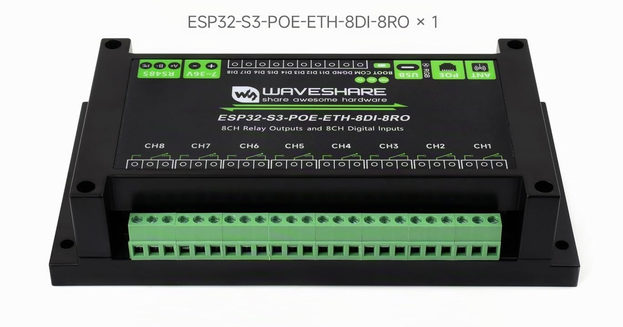
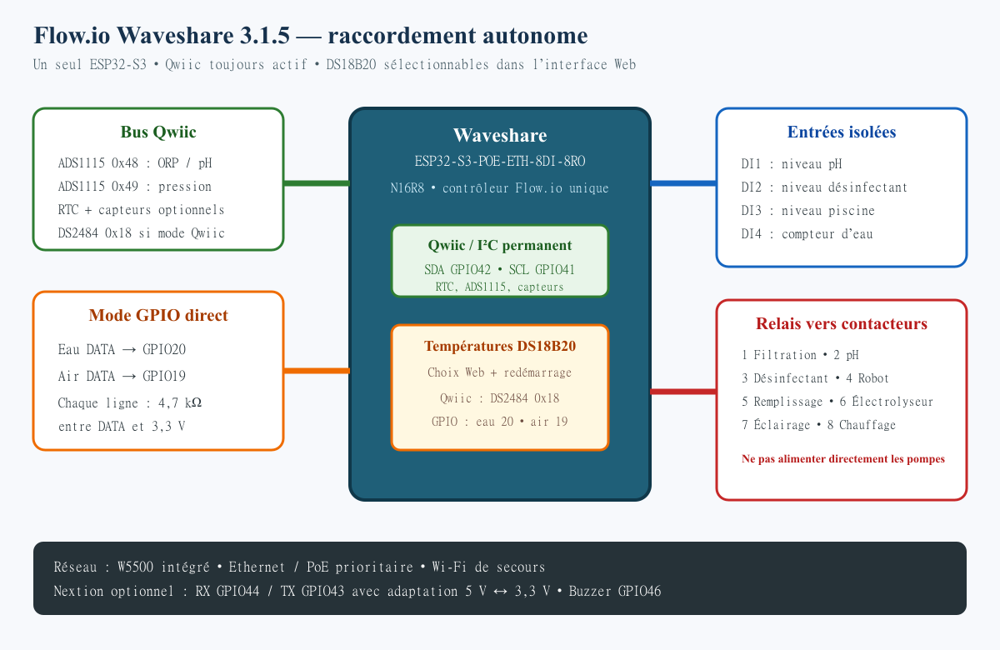
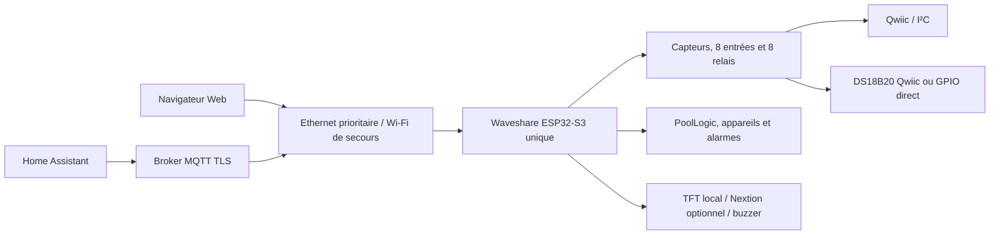

# Flow.io — contrôleur de piscine sur Waveshare ESP32-S3

Flow.io est un firmware de pilotage de piscine. La cible de référence du dépôt
est actuellement la carte **Waveshare ESP32-S3-POE-ETH-8DI-8RO N16R8**, utilisée de
façon autonome : un seul ESP32-S3 exécute les entrées/sorties, les automatismes,
les sécurités, le réseau, l’interface Web, MQTT et l’intégration Home Assistant.

La version déclarée pour cette cible est **3.4.0**. L’environnement PlatformIO à
utiliser est `Waveshare-ESP32-S3`, également défini comme environnement par
défaut dans `platformio.ini`.

Cette branche ne contient désormais que le profil Waveshare. Les profils FlowIO,
Supervisor, FlowConnectDisplay et Micronova, leurs cartes et leurs modules exclusifs
ont été retirés. Le Nextion local et le TFT S3 sont conservés ; le transport HMI UDP
de FlowConnectDisplay est supprimé. Les anciens documents multi-profils ci-dessous
sont des références historiques, pas des instructions de compilation de cette branche.

## État de validation 3.4.0 — 20 septembre 2026

La version 3.4.0 minifie l’interface Web, introduit deux couples indissociables
firmware/interface Web A/B avec vérification avant basculement et rollback au
démarrage, et place le journal d’activité dans une partition persistante
séparée. Le paquet complet s’installe depuis la page **Mises à jour**. Voir les
[notes de version 3.4.0](docs/release-3.4.0.md).

Elle ajoute aussi des comptes Web Administrateur/Opérateur avec sessions de
sept jours, un bouton de déconnexion, un historique piscine local sur sept
jours avec export CSV et une source d’état commune aux pages Piscine,
Entrées/Sorties et aux affectations de configuration.

La compilation du firmware, les contrôles JavaScript, l’image SPIFFS, les
ressources minifiées et le paquet ZIP ont été validés. Le firmware et la
SPIFFS ont été flashés sur la carte réelle ; la page de connexion et la
redirection sans session répondent par adresse IP et par `flowio.local`. Les
droits Administrateur/Opérateur après connexion, l’accumulation sur sept jours
et le rollback A/B restent à éprouver sur le matériel.

## État de validation 3.3.1 — 15 septembre 2026

La version 3.3.1 corrige la numérotation 3.30 (qui devait se lire 3.3.0) et
ajoute deux apports ciblés : l’allocation en PSRAM des documents JSON et
métadonnées volumineux, ainsi que l’actualisation en temps réel du tableau de
bord par SSE avec les fenêtres de gestion des équipements et des alarmes.
Les commandes Home Assistant des équipements empruntent désormais le même
routage métier `poollogic.device.write` que l’interface Web. Voir les
[notes de version 3.3.1](docs/release-3.3.1.md).

La compilation logicielle est vérifiée avant publication. Le flash et la
validation sur carte réelle restent nécessaires.

## État de validation 3.3.0 (branche historique `3.30`) — 14 septembre 2026

La version publiée sous le nom 3.30 reprend la base sécurisée 3.2.2 et intègre trois apports ciblés :
l'identification matérielle du Nextion et le contrôle de compatibilité des
artefacts nommés, un reçu persistant permettant de suivre le résultat d'une mise
à jour au-delà d'un redémarrage, et une surveillance de la pression mémoire
fondée sur la RAM interne réellement critique. Les détails figurent dans les
[notes de version 3.30](docs/release-3.30.md).

Le firmware et les deux nouveaux tests unitaires ont été compilés pour la cible
`Waveshare-ESP32-S3`. Aucun flash ni essai matériel de cette version n'a encore
été réalisé.

## État de validation 3.2.2 — 12 septembre 2026

Cette version distingue les mesures pH, ORP et de température figées lorsque la
circulation est arrêtée. Les automatismes attendent 90 secondes de mesures
stabilisées après le redémarrage, et une température figée de plus de 24 heures
entraîne temporairement un cycle minimal de deux heures, recalculé dès qu'une
nouvelle température fiable est disponible. Voir les
[notes de version 3.2.2](docs/release-3.2.2.md) pour le détail.

La récupération réseau a également été regroupée dans une seule page : après
un appui de cinq secondes sur BOOT, elle permet de préparer le compte Web, le
Wi-Fi, Ethernet et MQTT, puis ne redémarre la carte qu'au moment de
l'enregistrement final. Le premier appareil qui ouvre explicitement la page
réserve cette fenêtre de récupération de cinq minutes à son adresse IP.

Le firmware et la SPIFFS ont été compilés et flashés sur la carte réelle. Le
démarrage, le montage de la SPIFFS et le lancement du serveur Web ont été
contrôlés sur le port série. Le comportement lors d'un cycle réel d'arrêt et de
redémarrage de la filtration reste à observer.

## État de validation 3.2.1 — 6 septembre 2026

Cette version corrige la perte de connexion MQTT selon la combinaison
Ethernet/Wi-Fi active au démarrage ou lors d'une bascule à chaud, rend
l'interface Web utilisable sans accès Internet (police d'icônes
auto-hébergée) et affiche séparément les adresses IP Ethernet et Wi-Fi. Voir
les [notes de version 3.2.1](docs/release-3.2.1.md) pour le détail des
correctifs et de leur validation.

Firmware et SPIFFS ont été flashés et testés sur la carte réelle dans les
combinaisons suivantes : Ethernet seul, Wi-Fi seul, les deux puis
débranchement d'Ethernet à chaud, et Wi-Fi seul puis branchement/débranchement
d'Ethernet — MQTT reste connecté dans tous les cas. Cette validation reste
ponctuelle et ne remplace pas un essai d'endurance prolongé (voir
[RESTANT_A_FAIRE.md](RESTANT_A_FAIRE.md), priorité 1).

## État de validation 3.2.0 — 2 septembre 2026

Le firmware et les fichiers Web ont été compilés et flashés sur le Waveshare.
Le journal d’activité utilise des réponses bornées en PSRAM, des lots de 16 événements,
et annule son chargement lorsque la page est quittée. Les tests de concurrence,
d’annulation, de pagination et d’affichage des erreurs passent
(`node scripts/test_activity_page.cjs`), ainsi que `python scripts/verify_release.py`.
L’utilisateur confirme que le journal s’affiche à nouveau.

**Limite connue : les redémarrages watchdog ne sont pas résolus.** Le journal a
enregistré un démarrage `reset=task_wdt` à 21:04:23 le 2 septembre 2026 avec le
firmware `3.2.0+20260902.205208`, après le flash. La tâche responsable reste à
identifier par une capture série. Cette version constitue un point de sauvegarde,
pas une validation de stabilité prolongée.

Les images publiées dans `binary/` ne contiennent pas l’historique du contrôleur.
Une mise à jour complète du SPIFFS remplace ses fichiers : sauvegarder les données
locales avant de flasher cette partition. Les sauvegardes de diagnostic et l’image
locale contenant le journal conservé ne sont pas publiées dans le dépôt.

## Vue de la cible Waveshare

[](https://www.waveshare.com/esp32-s3-eth-8di-8ro.htm?sku=30838)

*Carte ESP32-S3-POE-ETH-8DI-8RO utilisée par Flow.io —
[fiche produit Waveshare](https://www.waveshare.com/esp32-s3-eth-8di-8ro.htm?sku=30838).*

### Raccordements utilisés par Flow.io



Cette vue résume les raccordements exploités par le firmware. Pour les tableaux
d’affectation complets et les précautions électriques, consulter le
[schéma de raccordement Waveshare](docs/integration/schema-raccordement-waveshare.md).

## Images de livraison (3.4.0)

La version 3.4.0 est compilée et flashée sur la Waveshare ESP32-S3 N16R8. Les
réglages persistants des versions précédentes restent compatibles.

Le dossier `binary` contient le firmware, l’interface Web associée et le paquet
complet A/B :

- `binary/flowios3-3.4.0.bin` — `2 293 088` octets — SHA-256
  `2d559851e7a911797453b3d2b4c26cbe9f8468d0fe87893013cc153de147bf6e` ;
- `binary/flowios3-spiffs-3.4.0.bin` — `1 572 864` octets — SHA-256
  `938139894aec280290ac60c963ec038405b63e73f0ded2f79e908c7404581223` ;
- `binary/flowio-3.4.0.zip` — paquet atomique contenant manifeste, firmware et
  SPIFFS.

Le manifeste `binary/manifest.json` référence seulement ces artefacts utiles à
la version courante.

## Architecture exécutée



La PSRAM est activée et utilisée pour les structures volumineuses, notamment
les descripteurs d’entrées/sorties et une partie des données d’exécution. Si les
allocations indispensables à la cible Waveshare échouent, l’initialisation
échoue explicitement au lieu de poursuivre avec un fonctionnement dégradé non
maîtrisé.

## Fonctions disponibles

### Pilotage de la piscine

L’interface propose trois niveaux de fonctionnement :

- **Manuel / maintenance** : commandes directes, sans automatismes ni
  sécurités gérés par PoolLogic ;
- **Manuel sécurisé** : commandes manuelles avec surveillance et interlocks ;
- **Automatique** : surveillance, sécurités et pilotage selon les horaires,
  mesures et consignes.

Les fonctions actuellement implémentées comprennent :

- calcul de la durée et de la plage quotidienne de filtration selon la
  température de l’eau, avec gestion du passage à minuit et de la filtration
  continue ;
- mode hiver et protection antigel ;
- surveillance des pressions basse et haute, désactivable lorsqu’aucun capteur
  de pression n’est installé ;
- surveillance optionnelle du débit par contact sec, avec arrêt de la filtration
  et des équipements dépendants lorsque le débit reste absent après le délai de
  validation ;
- régulation temporelle PID du pH et de la désinfection chlore/brome ;
- électrolyseur piloté par consigne ORP ou en continu avec la filtration ;
- dosage d’oxygène actif par volume calculé, calendrier hebdomadaire et
  compensation de température ;
- chauffage automatique avec cycle de filtration de sondage pour une sonde en
  canalisation ; avec une sonde dans le bassin, la température continue évite
  ces cycles et la filtration ne démarre que si le chauffage est demandé ;
- robot automatique, remplissage, éclairage et commandes manuelles ;
- dépendances entre appareils, limites de temps de marche, suivi des volumes
  injectés et niveaux théoriques des bidons.

Le tableau de bord regroupe l’état général et la plage de filtration, puis les
cartes **Mode**, **Équipements**, **Sondes** et **Alarmes**. Les sondes ont des
couleurs distinctes. Les interrupteurs sont gris à l’arrêt, verts lorsqu’ils
sont actifs et bleus pour la filtration en marche, sans animation. Il permet
de changer le mode sans quitter sa vue d’ensemble. Les textes courants restent
utilisent la pile de polices système, les tailles, les graisses et les
espacements définis par la maquette du fork. Le menu signale la page active par
sa couleur.
Dans `Piscine > Contrôle des équipements`, les commandes suivent l’ordre
filtration, électrolyseur ou pompe à chlore, pompe pH, éclairage, mode hiver,
robot, chauffage et remplissage. Un équipement désactivé ou non affecté n’est
pas affiché.

La limite quotidienne de l’électrolyseur dépend du mode : elle est neutralisée
en manuel ou maintenance, tandis qu’en automatique elle ne peut pas être
inférieure à la durée de filtration calculée augmentée de 60 minutes. Les
dépendances et sécurités matérielles, notamment la filtration, restent
prioritaires dans tous les modes.

Tous les automatismes sont désactivés par défaut à la première mise en service.

### Entrées, capteurs et sorties

Le profil Waveshare affecte par défaut :

| Ressource | Usage principal |
|---|---|
| Relais 1 à 8 | filtration, pH, désinfection unique, robot, remplissage, libre, éclairage, chauffage |
| DI1 à DI4 | niveau pH, niveau désinfectant, niveau piscine, compteur d’eau |
| DI5 à DI8 | libres ou retours de contacteurs configurables |
| ADS1115 pH/ORP `0x48` ou `0x49` | ORP sur A0 et pH sur A1 |
| Second ADS1115, autre adresse | pression sur un canal A0 à A3 au choix |
| RTC PCF85063 | horloge locale et planification |

Sur Waveshare, le relais 3 (`CH3`) est l’unique sortie de désinfection : il
commande la pompe à chlore/oxygène actif **ou** l’électrolyseur selon le type de
traitement choisi. Le relais 6 (`CH6`) est désormais libre ; les deux appareils
ne peuvent donc pas être commandés simultanément par erreur.

Le bus Qwiic/I²C utilise `GPIO42` pour SDA et `GPIO41` pour SCL à `400 kHz`. Il peut aussi
accueillir les capteurs optionnels INA226, SHT40, BMP280 et BME680.

Dans `Piscine > Affectation des sondes`, la carte pH/ORP ne propose pas
d'entrée analogique interchangeable. Ses canaux sont fixes ; seul le choix de
son adresse I²C `0x48` ou `0x49` est affiché. Le second ADS1115 reçoit
automatiquement l'autre adresse.

La pression peut être affectée à une entrée Axx disponible ou à l'un des quatre
canaux A0 à A3 de l'ADS1115 externe sur Qwiic. Chaque canal est lu séparément
par rapport à la masse commune. L'interface affiche uniquement l'adresse I²C
libre, `0x48` ou `0x49`, selon l'adresse retenue pour la carte pH/ORP. La page
`Entrées/Sorties` rappelle les adresses et canaux réellement attribués aux deux
ADS1115. Les entrées y sont nommées `DI1` à `DI8` et les sorties relais
`CH1` à `CH8`, conformément à la sérigraphie du Waveshare. Les identifiants
techniques `PortExio*` restent internes au firmware.
L'ancien slot `io_chl_gen` devient un relais `CH6` ordinaire, disponible dans
les affectations. L'électrolyse utilise toujours l'unique relais choisi pour la
désinfection. Le tableau des affectations fonctionnelles est construit depuis
la configuration enregistrée et suit donc les changements effectués dans
`Piscine`. Par défaut, la pression utilise le canal A0 du second ADS1115.

Dans `Piscine > Affectation des relais`, chaque fonction conserve son type de
périphérique et ses sécurités ; seul son raccordement physique `CH1` à
`CH8` est modifié. Une sortie ne peut être choisie qu'une fois et `CH6` est
libre par défaut. Les mêmes raccordements apparaissent dans
`Configuration > io/output` et dans `Entrées/Sorties` après redémarrage. Les
anciens sélecteurs internes `poollogic/devices` sont masqués sur Waveshare pour
éviter deux réglages concurrents.

Une modification de canal ADS1115, d'adresse I²C, de transport DS2484 ou de
raccordement physique d'une entrée ou d'un relais impose de reconstruire les
pilotes. Depuis `Piscine`, l'interface annonce ce redémarrage avant
l'enregistrement puis redémarre le Waveshare automatiquement.

Les désignations Axx sont des identifiants d'entrées analogiques logiques. Dans
la configuration Piscine actuelle, l'ORP et le pH occupent A0 et A1 de leur
carte ADS1115, la pression peut utiliser un canal du second ADS1115, et les
températures DS18B20 passent par un GPIO direct ou par le pont DS2484. Les
contacts de niveau, le détecteur de débit et les retours de contacteurs restent
des entrées numériques.

Le raccordement des deux sondes DS18B20 se choisit séparément dans
`Piscine > Affectation des sondes` :

| Sonde | Raccordement direct | Raccordement I²C / Qwiic |
|---|---|---|
| Température eau | entrée Axx disponible, physiquement reliée à GPIO20 | bus 1-Wire via le DS2484 `0x18` |
| Température air | entrée Axx disponible, physiquement reliée à GPIO19 | bus 1-Wire via le DS2484 `0x18` |

Les deux modes peuvent être combinés. Deux sondes placées sur le DS2484
partagent le même bus et sont distinguées par leur adresse ROM. Un changement
de raccordement prend effet après redémarrage.

### Alarmes

Le moteur d’alarmes gère notamment :

- pression basse ou haute ;
- niveau bas des bidons pH et désinfectant ;
- temps de marche maximal des pompes doseuses ;
- niveau d’eau bas ;
- incohérence des retours de contacteurs de filtration ou d’électrolyseur ;
- absence de débit après démarrage lorsque le détecteur est configuré ;
- température d’eau indisponible ;
- avertissements et erreurs internes ;
- échecs répétés de signature OTA.

Les alarmes sont publiées par MQTT et découvertes comme capteurs binaires par
Home Assistant. Les notifications mobiles, courriels ou SMS se configurent dans
Home Assistant ; le firmware n’envoie pas directement de SMS ou de courriel.

### Réseau et interface Web

- Ethernet W5500 avec DHCP, activé par défaut et prioritaire ;
- tentative Wi-Fi après environ 7 secondes sans adresse Ethernet ;
- portail de configuration après échec du Wi-Fi enregistré ;
- interface Web sur le port HTTP 80 ;
- adresse habituelle : `http://flowio.local/webinterface` ;
- accès de secours par l’adresse IP affichée dans le moniteur série ;
- publication mDNS du service HTTP sur Ethernet et Wi-Fi ;
- reconnexion MQTT forcée lors d’une bascule Ethernet/Wi-Fi à chaud, et route
  réseau par défaut réévaluée à chaque changement d’interface active pour que
  la résolution DNS reste correcte quelle que soit la combinaison ;
- adresses IP Ethernet et Wi-Fi affichées indépendamment sur le tableau de
  bord, la page Réseau et la page Informations, chacune masquée lorsque
  l’interface correspondante n’est pas connectée ;
- icônes de l’interface Web servies par une police auto-hébergée : aucune
  dépendance à un accès Internet ;
- interface complète depuis SPIFFS et page minimale de récupération intégrée au
  firmware ;
- récupération par appui de cinq secondes sur BOOT : depuis le point d'accès
  `flow.io-xxxxxx`, ouvrir `http://192.168.4.1/rescue` ; depuis Ethernet, ouvrir
  `http://flowio.local/rescue` ou l'adresse DHCP de la carte ;
- page Rescue unique pour préparer le compte Web, le Wi-Fi, Ethernet (DHCP ou
  IPv4 fixe) et MQTT, avec annulation ou enregistrement global suivi d'un seul
  redémarrage ;
- fenêtre Rescue physique limitée à cinq minutes et réservée à l'adresse IP du
  premier appareil qui ouvre la page ;
- réglages de l’onglet Piscine préparés localement dans chaque carte, avec
  indication des modifications en attente et choix explicite entre annulation
  et enregistrement ;
- tableau de bord avec changement de mode, page Piscine réorganisée et panneau
  de commandes directes limité aux équipements réellement configurés ;
- navigation latérale réordonnée, avec `Entrées/Sorties` placé après
  `Configuration` et `Mises à Jour` placé après `Utilisateurs`.

Lorsque MQTT était valide au démarrage précédent, le serveur Web en mode station
peut attendre jusqu’à 30 secondes la connexion MQTT TLS afin de préserver assez
de mémoire interne pour la négociation cryptographique. Lors d’une première mise
en route ou après un démarrage où MQTT n’était pas valide, le serveur Web est
libéré immédiatement pour permettre de corriger la configuration.

### MQTT et Home Assistant

Le client MQTT impose actuellement :

- TLS (`mqtts://`) et port par défaut `8883` ;
- validation du certificat par le bundle de certificats ESP ;
- nom d’utilisateur et mot de passe non vides ;
- reconnexion avec temporisation progressive ;
- identifiant de topics configurable ou généré depuis la MAC ;
- limitation du trafic entrant et files de publication prioritaires.

Home Assistant Discovery expose les mesures, entrées, sorties, appareils,
consignes, modes, états des automatismes et alarmes. Il faut utiliser un compte
MQTT propre à l’appareil et limiter ses ACL à l’arbre de topics Flow.io concerné
ainsi qu’à ses topics de découverte.

## Installation et premier démarrage

### Compilation et flash avec PlatformIO

Ouvrir le dépôt dans Visual Studio Code, puis utiliser exclusivement les tâches
de `Waveshare-ESP32-S3`.

Pour une mise à jour normale :

1. lancer `Build` ;
2. lancer `Upload` pour le firmware ;
3. lancer `Upload Filesystem Image` si les fichiers Web ont changé ou si la
   carte a été effacée ;
4. ouvrir `Monitor` à 115200 bauds.

Équivalent en ligne de commande :

```text
pio run -e Waveshare-ESP32-S3
pio run -e Waveshare-ESP32-S3 -t upload
pio run -e Waveshare-ESP32-S3 -t buildfs
pio run -e Waveshare-ESP32-S3 -t uploadfs
pio device monitor -e Waveshare-ESP32-S3
```

Pour repartir d’une mémoire entièrement vierge :

```text
pio run -e Waveshare-ESP32-S3 -t erase
pio run -e Waveshare-ESP32-S3 -t upload
pio run -e Waveshare-ESP32-S3 -t uploadfs
```

Le firmware et SPIFFS doivent toujours provenir de la même révision.

### Mise en service

Pour une carte neuve ou effacée, suivre d'abord le
[tutoriel de première connexion](docs/integration/premiere-connexion.md).

1. Laisser les équipements de puissance arrêtés.
2. Vérifier les journaux de démarrage et l’adresse IP.
3. Créer l'administrateur par la récupération physique BOOT.
4. Configurer le Wi-Fi de secours et, si nécessaire, MQTT.
5. Choisir le raccordement des sondes DS18B20, puis redémarrer.
6. Vérifier chaque mesure, entrée et relais individuellement.
7. Étalonner pH, ORP et pression.
8. Activer d’abord le mode manuel sécurisé, puis les automatismes un par un.

## Sécurité

L’interface Web locale utilise HTTP et ne doit jamais être exposée directement
à Internet. Utiliser un réseau d’administration de confiance, un VPN ou Home
Assistant pour l’accès distant.

Aucun administrateur par défaut n’est créé. Sur une carte vierge, maintenir le
bouton BOOT cinq secondes après un démarrage normal ouvre pendant cinq minutes
la configuration initiale et permet de définir un administrateur. La même
présence physique permet ensuite de remplacer ses identifiants. Hors de cette
fenêtre, les réglages Wi-Fi et MQTT exigent l’administrateur Web.

Le point d’accès de secours reçoit un mot de passe aléatoire propre à la carte,
conservé en NVS et affiché uniquement sur le moniteur série USB lorsqu’il
démarre. Après un flash du firmware par PlatformIO, les mêmes identifiants sont
aussi récupérés directement par l'USB dans `local-device/rescue-access.txt`.
Ce fichier local est exclu de Git et contient le mot de passe en clair. Les API
Web ne renvoient plus les mots de passe Wi-Fi ou MQTT
enregistrés ; un champ vide lors d’une modification conserve le secret existant.
L’interface indique explicitement si l’utilisateur est administrateur, si la
récupération physique est active ou si l’accès utilise le mode
« Opérateur local — non identifié ».

L’interface reste accessible sans compte en mode Opérateur local afin de
consulter et piloter la piscine sur le réseau local. Ce mode n’accède pas au
réseau, à la configuration, aux utilisateurs, aux mises à jour, aux commandes
de redémarrage et de récupération, ni à l’étalonnage. Ces restrictions sont
appliquées dans le menu et côté serveur. La connexion administrateur reste
disponible depuis le menu ou la page de connexion. Les sessions identifiées
sont valables sept jours. Le réglage **Interface Web > Exiger
l’authentification Web**, désactivé par défaut, permet d’imposer une connexion
dès l’ouverture. Les actions modifiant l’état exigent aussi un jeton CSRF.

Les mises à jour du firmware sont prévues pour être signées en ECDSA P-256 et
échouent si la clé publique de production ou la signature manque. La clé de
production n’est pas fournie dans le dépôt : la chaîne OTA signée doit donc être
finalisée avant tout déploiement distant en production.

Les relais de la carte doivent commander des contacteurs et protections adaptés.
Ils ne remplacent ni les protections électriques ni les sécurités indépendantes
exigées pour les pompes, le chauffage et les systèmes de dosage.

## Qualité et validations automatiques

La CI du dépôt prévoit :

- détection de secrets avec Gitleaks ;
- analyse statique C++ avec Cppcheck ;
- tests natifs du calcul de filtration ;
- tests natifs de la politique Web, CSRF et signature OTA ;
- compilation du firmware Waveshare et de SPIFFS ;
- contrôle de la taille du firmware ;
- vérification du manifeste et des empreintes des artefacts.

La couverture automatisée reste limitée par rapport à l’étendue des
automatismes. Les validations encore nécessaires sont décrites dans
[RESTANT_A_FAIRE.md](RESTANT_A_FAIRE.md).

## Organisation du dépôt

| Chemin | Contenu |
|---|---|
| `src/Profiles/Waveshare` | assemblage de la cible autonome actuelle |
| `src/Modules` | réseau, Web, MQTT, HMI, E/S, appareils, logique piscine et alarmes |
| `src/Domain/Pool` | rôles, appareils et affectations fonctionnelles de la piscine |
| `data/webinterface` | interface Web placée dans SPIFFS |
| `docs` | architecture, modules, intégration, sécurité et raccordement |
| `scripts` | génération des données, des artefacts et contrôles de version |
| `test` | tests natifs PlatformIO |
| `binary` | artefacts publiés et manifeste |

Les profils `FlowIO`, `Supervisor`, `FlowConnectDisplay`, `Micronova` et les
profils Wokwi restent présents dans le code. Ils ne font pas partie du périmètre
de validation de la version Waveshare 3.1.5 et ne doivent pas être utilisés pour
déduire le câblage de la cible autonome actuelle.

## Références utiles

- [État des améliorations restantes](RESTANT_A_FAIRE.md)
- [Notes de version 3.4.0](docs/release-3.4.0.md)
- [Notes de version 3.2.1](docs/release-3.2.1.md)
- [Notes de version 3.1.5](docs/release-3.1.5.md)
- [Audit technique du socle 3.1.3](AUDIT_2026-08-16.md)
- [Raccordement Waveshare](docs/integration/schema-raccordement-waveshare.md)
- [Première connexion](docs/integration/premiere-connexion.md)
- [Mise en service](docs/integration/mise-en-service.md)
- [Vues de l’interface Web 3.1.5](docs/integration/interface-web-3.1.5.md)
- [Logique piscine](docs/modules/PoolLogicModule.md)
- [Topics MQTT](docs/core/mqtt-topics.md)
- [Durcissement de sécurité](docs/security-hardening.md)
- [Signature OTA](docs/ota-signing.md)
