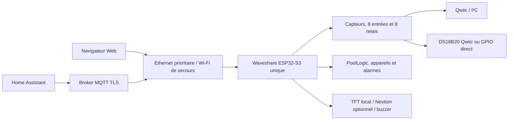

# Flow.io — contrôleur de piscine sur Waveshare ESP32-S3

Flow.io est un firmware de pilotage de piscine. La cible de référence du dépôt
est actuellement la carte **Waveshare ESP32-S3-ETH-8DI-8RO N16R8**, utilisée de
façon autonome : un seul ESP32-S3 exécute les entrées/sorties, les automatismes,
les sécurités, le réseau, l’interface Web, MQTT et l’intégration Home Assistant.

La version déclarée pour cette cible est **3.1.3**. L’environnement PlatformIO à
utiliser est `Waveshare-ESP32-S3`, également défini comme environnement par
défaut dans `platformio.ini`.

## État actuel

Le firmware 3.1.3 est compilable et a été flashé sur la carte réelle. Les essais
effectués couvrent le démarrage, l’accès Web par adresse IP et par
`flowio.local`, la connexion MQTT TLS ainsi que le fonctionnement réseau en
Ethernet et en Wi-Fi. Ces essais confirment l’intégration générale, mais ne
constituent pas encore une validation exhaustive de toutes les entrées, sorties
et séquences de sécurité sur une installation complète.

Le dépôt contient le firmware validé :

- `binary/flowios3-3.1.3.bin` ;
- taille : `2 133 488` octets ;
- SHA-256 : `f5ff41e35f2024a962596e8ccbb91e68eb27cddbd8608b1e04e6f5b12e7304f2`.

L’image SPIFFS 3.1.3 contenant l’interface Web est générée par `buildfs`. Elle
n’est pas encore présente comme artefact 3.1.3 final dans le dossier `binary` :
un effacement complet de la carte doit donc être suivi d’une compilation et
d’un téléversement du système de fichiers depuis la même révision du projet.

## Architecture exécutée



La PSRAM est activée et utilisée pour les structures volumineuses, notamment
les descripteurs d’entrées/sorties et une partie des données d’exécution. Si les
allocations indispensables à la cible Waveshare échouent, l’initialisation
échoue explicitement au lieu de poursuivre avec un fonctionnement dégradé non
maîtrisé.

## Fonctions disponibles

### Pilotage de la piscine

L’interface propose trois niveaux de fonctionnement :

- **Manuel / maintenance** : commandes directes, sans automatismes ni
  sécurités gérés par PoolLogic ;
- **Manuel sécurisé** : commandes manuelles avec surveillance et interlocks ;
- **Automatique** : surveillance, sécurités et pilotage selon les horaires,
  mesures et consignes.

Les fonctions actuellement implémentées comprennent :

- calcul de la durée et de la plage quotidienne de filtration selon la
  température de l’eau, avec gestion du passage à minuit et de la filtration
  continue ;
- mode hiver et protection antigel ;
- surveillance des pressions basse et haute, désactivable lorsqu’aucun capteur
  de pression n’est installé ;
- régulation temporelle PID du pH et de la désinfection chlore/brome ;
- électrolyseur piloté par consigne ORP ou en continu avec la filtration ;
- dosage d’oxygène actif par volume calculé, calendrier hebdomadaire et
  compensation de température ;
- chauffage automatique avec cycle de filtration de sondage lorsque la mesure
  d’eau nécessite une circulation ;
- robot automatique, remplissage, éclairage et commandes manuelles ;
- dépendances entre appareils, limites de temps de marche, suivi des volumes
  injectés et niveaux théoriques des bidons.

Tous les automatismes sont désactivés par défaut à la première mise en service.

### Entrées, capteurs et sorties

Le profil Waveshare affecte par défaut :

| Ressource | Usage principal |
|---|---|
| Relais 1 à 8 | filtration, pH, désinfection, robot, remplissage, électrolyseur, éclairage, chauffage |
| DI1 à DI4 | niveau pH, niveau désinfectant, niveau piscine, compteur d’eau |
| DI5 à DI8 | libres ou retours de contacteurs configurables |
| ADS1115 `0x48` | ORP et pH |
| ADS1115 `0x49` | pression et réserve analogique |
| RTC PCF85063 | horloge locale et planification |

Le bus Qwiic/I²C utilise `GPIO42` pour SDA et `GPIO41` pour SCL. Il peut aussi
accueillir les capteurs optionnels INA226, SHT40, BMP280 et BME680.

Les deux sondes DS18B20 sont sélectionnables dans
`Configuration > io > drivers > ds18b20` :

| Mode | Température eau | Température air | Bus Qwiic restant |
|---|---|---|---|
| `Qwiic / DS2484` | bus 1-Wire via DS2484 `0x18` | même bus, ROM distincte | actif |
| `GPIO direct` | GPIO20 | GPIO19 | actif pour les autres composants |

Le changement de transport DS18B20 prend effet après redémarrage.

### Alarmes

Le moteur d’alarmes gère notamment :

- pression basse ou haute ;
- niveau bas des bidons pH et désinfectant ;
- temps de marche maximal des pompes doseuses ;
- niveau d’eau bas ;
- incohérence des retours de contacteurs de filtration ou d’électrolyseur ;
- température d’eau indisponible ;
- avertissements et erreurs internes ;
- échecs répétés de signature OTA.

Les alarmes sont publiées par MQTT et découvertes comme capteurs binaires par
Home Assistant. Les notifications mobiles, courriels ou SMS se configurent dans
Home Assistant ; le firmware n’envoie pas directement de SMS ou de courriel.

### Réseau et interface Web

- Ethernet W5500 avec DHCP, activé par défaut et prioritaire ;
- tentative Wi-Fi après environ 7 secondes sans adresse Ethernet ;
- portail de configuration après échec du Wi-Fi enregistré ;
- interface Web sur le port HTTP 80 ;
- adresse habituelle : `http://flowio.local/webinterface` ;
- accès de secours par l’adresse IP affichée dans le moniteur série ;
- publication mDNS du service HTTP sur Ethernet et Wi-Fi ;
- interface complète depuis SPIFFS et page minimale de récupération intégrée au
  firmware.

Lorsque MQTT était valide au démarrage précédent, le serveur Web en mode station
peut attendre jusqu’à 30 secondes la connexion MQTT TLS afin de préserver assez
de mémoire interne pour la négociation cryptographique. Lors d’une première mise
en route ou après un démarrage où MQTT n’était pas valide, le serveur Web est
libéré immédiatement pour permettre de corriger la configuration.

### MQTT et Home Assistant

Le client MQTT impose actuellement :

- TLS (`mqtts://`) et port par défaut `8883` ;
- validation du certificat par le bundle de certificats ESP ;
- nom d’utilisateur et mot de passe non vides ;
- reconnexion avec temporisation progressive ;
- identifiant de topics configurable ou généré depuis la MAC ;
- limitation du trafic entrant et files de publication prioritaires.

Home Assistant Discovery expose les mesures, entrées, sorties, appareils,
consignes, modes, états des automatismes et alarmes. Il faut utiliser un compte
MQTT propre à l’appareil et limiter ses ACL à l’arbre de topics Flow.io concerné
ainsi qu’à ses topics de découverte.

## Installation et premier démarrage

### Compilation et flash avec PlatformIO

Ouvrir le dépôt dans Visual Studio Code, puis utiliser exclusivement les tâches
de `Waveshare-ESP32-S3`.

Pour une mise à jour normale :

1. lancer `Build` ;
2. lancer `Upload` pour le firmware ;
3. lancer `Upload Filesystem Image` si les fichiers Web ont changé ou si la
   carte a été effacée ;
4. ouvrir `Monitor` à 115200 bauds.

Équivalent en ligne de commande :

```text
pio run -e Waveshare-ESP32-S3
pio run -e Waveshare-ESP32-S3 -t upload
pio run -e Waveshare-ESP32-S3 -t buildfs
pio run -e Waveshare-ESP32-S3 -t uploadfs
pio device monitor -e Waveshare-ESP32-S3
```

Pour repartir d’une mémoire entièrement vierge :

```text
pio run -e Waveshare-ESP32-S3 -t erase
pio run -e Waveshare-ESP32-S3 -t upload
pio run -e Waveshare-ESP32-S3 -t uploadfs
```

Le firmware et SPIFFS doivent toujours provenir de la même révision.

### Mise en service

1. Laisser les équipements de puissance arrêtés.
2. Vérifier les journaux de démarrage et l’adresse IP.
3. Ouvrir l’interface Web par IP ou par `flowio.local`.
4. Configurer le Wi-Fi de secours et, si nécessaire, MQTT.
5. Choisir le raccordement des sondes DS18B20, puis redémarrer.
6. Vérifier chaque mesure, entrée et relais individuellement.
7. Étalonner pH, ORP et pression.
8. Activer d’abord le mode manuel sécurisé, puis les automatismes un par un.

## Sécurité

L’interface Web locale utilise HTTP et ne doit jamais être exposée directement
à Internet. Utiliser un réseau d’administration de confiance, un VPN ou Home
Assistant pour l’accès distant.

Une fois un utilisateur et un mot de passe Web configurés, les routes
d’administration utilisent l’authentification Digest. Les actions modifiant
l’état nécessitent également un jeton CSRF. Le bouton BOOT maintenu cinq
secondes après un démarrage normal ouvre une fenêtre physique de récupération
de dix minutes permettant de remplacer les identifiants Web.

Les mises à jour du firmware sont prévues pour être signées en ECDSA P-256 et
échouent si la clé publique de production ou la signature manque. La clé de
production n’est pas fournie dans le dépôt : la chaîne OTA signée doit donc être
finalisée avant tout déploiement distant en production.

Les relais de la carte doivent commander des contacteurs et protections adaptés.
Ils ne remplacent ni les protections électriques ni les sécurités indépendantes
exigées pour les pompes, le chauffage et les systèmes de dosage.

## Qualité et validations automatiques

La CI du dépôt prévoit :

- détection de secrets avec Gitleaks ;
- analyse statique C++ avec Cppcheck ;
- tests natifs du calcul de filtration ;
- tests natifs de la politique Web, CSRF et signature OTA ;
- compilation du firmware Waveshare et de SPIFFS ;
- contrôle de la taille du firmware ;
- vérification du manifeste et des empreintes des artefacts.

La couverture automatisée reste limitée par rapport à l’étendue des
automatismes. Les validations encore nécessaires sont décrites dans
[RESTANT_A_FAIRE.md](RESTANT_A_FAIRE.md).

## Organisation du dépôt

| Chemin | Contenu |
|---|---|
| `src/Profiles/Waveshare` | assemblage de la cible autonome actuelle |
| `src/Modules` | réseau, Web, MQTT, HMI, E/S, appareils, logique piscine et alarmes |
| `src/Domain/Pool` | rôles, appareils et affectations fonctionnelles de la piscine |
| `data/webinterface` | interface Web placée dans SPIFFS |
| `docs` | architecture, modules, intégration, sécurité et raccordement |
| `scripts` | génération des données, des artefacts et contrôles de version |
| `test` | tests natifs PlatformIO |
| `binary` | artefacts publiés et manifeste |

Les profils `FlowIO`, `Supervisor`, `FlowConnectDisplay`, `Micronova` et les
profils Wokwi restent présents dans le code. Ils ne font pas partie du périmètre
de validation de la version Waveshare 3.1.3 et ne doivent pas être utilisés pour
déduire le câblage de la cible autonome actuelle.

## Références utiles

- [État des améliorations restantes](RESTANT_A_FAIRE.md)
- [Notes techniques 3.1.3](docs/release-3.1.3.md)
- [Raccordement Waveshare](docs/integration/schema-raccordement-waveshare.md)
- [Mise en service](docs/integration/mise-en-service.md)
- [Logique piscine](docs/modules/PoolLogicModule.md)
- [Topics MQTT](docs/core/mqtt-topics.md)
- [Durcissement de sécurité](docs/security-hardening.md)
- [Signature OTA](docs/ota-signing.md)
