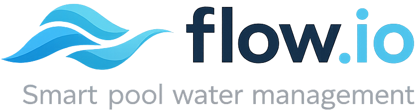

  

# flow.io — le pilotage de votre piscine

flow.io automatise la filtration, le traitement et les équipements de la piscine à partir des mesures et des réglages de l’installation. Le contrôleur fonctionne localement sur une carte Waveshare ESP32-S3 : l’interface reste accessible sur le réseau local, même sans service cloud.

Cette branche, **flow.io-waveshare-3.4.3**, ajoute un forçage temporaire des équipements, avec retour automatique au pilotage normal à son expiration.

## Ce que flow.io peut faire

### Surveiller l’eau et le circuit

Selon les sondes raccordées, flow.io suit le pH, l’ORP, la température de l’eau et de l’air, la pression hydraulique et les contacts de niveau. Un détecteur de débit et des retours de disjoncteurs peuvent compléter la surveillance.

Les capteurs de pression et de débit sont optionnels. Lorsqu’ils sont configurés, les limites de pression et l’absence de débit peuvent déclencher une alarme et arrêter la filtration selon les sécurités réglées.

### Adapter la filtration et le traitement

- calculer les plages de filtration à partir de la température de l’eau et des horaires autorisés ;
- gérer le mode hiver et la protection hors-gel ;
- réguler le pH avec une pompe doseuse pH− ou pH+ ;
- piloter une désinfection au chlore/brome, à l’oxygène actif ou par électrolyse au sel ;
- coordonner les traitements et équipements avec la filtration, les mesures disponibles et les sécurités configurées.

### Coordonner les équipements

flow.io peut commander la filtration, les pompes pH et désinfection, l’électrolyseur, le chauffage, le robot, le remplissage et l’éclairage. Les dépendances sont gérées par le contrôleur : les équipements qui exigent une circulation ne peuvent pas démarrer indépendamment de la filtration.

### Garder le contrôle depuis l’interface

L’interface Web responsive regroupe le tableau de bord, les mesures, les modes, les équipements, les alarmes, la configuration et les mises à jour. Un journal d’activité local conserve les événements récents.

L’accès opérateur est disponible sans compte par défaut. Les réglages sensibles nécessitent une session administrateur ; la configuration peut aussi imposer l’identification dès l’ouverture.

## Affecter librement les relais

La carte Waveshare expose huit sorties repérées **CH1 à CH8**. Dans **Piscine → Affectation des relais**, chacune des sept fonctions peut être associée à n’importe laquelle de ces sorties.

Si une sortie est déjà attribuée, la choisir échange automatiquement les affectations des deux fonctions. Cela permet de réorganiser les relais sans créer de doublon. Les changements sont enregistrés ensemble et nécessitent le redémarrage du contrôleur pour appliquer le nouveau raccordement.

La fonction **Désinfection** commande la méthode sélectionnée dans les réglages : pompe chlore/brome, pompe d’oxygène actif ou électrolyseur. Elle utilise le relais choisi pour cette fonction.

## Vue d’ensemble

~~~mermaid
flowchart LR
    WEB["Interface Web locale"] <--> CTRL["Waveshare ESP32-S3"]
    HA["Home Assistant"] <--> MQTT["MQTT avec TLS"]
    MQTT <--> CTRL
    CTRL --> LOGIC["Automatismes et sécurités"]
    CTRL --> IO["Sondes · 8 entrées · 8 relais"]
    CTRL --> DISPLAY["Écran local optionnel"]
    IO --> POOL["Filtration · traitement · chauffage · équipements"]
~~~

## Matériel de référence

Le firmware cible la carte [Waveshare ESP32-S3-POE-ETH-8DI-8RO N16R8](https://www.waveshare.com/product/iot-communication/esp32-s3-eth-8di-8ro.htm), avec Ethernet, Wi-Fi, huit entrées numériques, huit relais, RTC et PSRAM.

| Mesure ou fonction | Raccordement de référence |
|---|---|
| pH et ORP | Carte ADS1115 pH/ORP ; ORP sur A0, pH sur A1 |
| Pression | Capteur analogique sur une entrée disponible ou sur l’ADS1115 externe |
| Températures eau et air | Sondes DS18B20 en direct ou via le pont Qwiic DS2484 |
| Niveaux, débit et retours | Contacts numériques selon le câblage |
| Écran | TFT intégré ou écran Nextion en option |

Les affectations et adresses réelles sont visibles dans **Piscine** et **Entrées/Sorties**. Consultez le [schéma de raccordement Waveshare](docs/integration/schema-raccordement-waveshare.md) avant tout câblage.

## Réseau et domotique

- Ethernet prioritaire, avec Wi-Fi disponible comme connexion de secours ;
- interface Web locale, sans dépendance à Internet pour l’usage courant ;
- MQTT chiffré par TLS ;
- découverte des mesures, appareils, modes et alarmes dans Home Assistant ;
- synchronisation de l’heure pour les plages et automatismes.

L’accès Web n’est pas conçu pour être exposé directement à Internet. Pour une supervision à distance, utilisez un accès sécurisé configuré sur votre réseau ou votre installation domotique.

## Installer ou compiler

La cible PlatformIO de cette branche est **Waveshare-ESP32-S3**. Il faut PlatformIO Core ou Visual Studio Code avec l’extension PlatformIO.

~~~sh
git clone --branch flow.io-waveshare-3.4.3 https://github.com/D-Salmon/flow.io.git
cd flow.io
pio run -e Waveshare-ESP32-S3
~~~

Pour téléverser depuis PlatformIO :

~~~sh
pio run -e Waveshare-ESP32-S3 -t upload
pio run -e Waveshare-ESP32-S3 -t uploadfs
~~~

Le firmware et l’image SPIFFS doivent provenir de la même révision. Pour une première installation, laisser les équipements de puissance arrêtés, suivre le [guide de première connexion](docs/integration/premiere-connexion.md), vérifier chaque entrée et sortie, puis activer les automatismes progressivement.

## État de la branche 3.4.3

Un équipement piloté automatiquement peut être forcé temporairement depuis le tableau de bord ou la page Piscine. La durée est réglable de 1 à 1440 minutes. À l’expiration, la commande automatique reprend ; les dépendances de sécurité, les limites de fonctionnement et les équipements désactivés continuent de s’appliquer. Le forçage n’est pas conservé après un redémarrage.

Cette version est préparée sur sa branche locale et doit être compilée avant tout flash. Elle n’a pas été flashée.

## Documentation et sécurité

- [Documentation technique](docs/README.md)
- [Première connexion et création du compte administrateur](docs/integration/premiere-connexion.md)
- [Mise en service et vérifications](docs/integration/mise-en-service.md)
- [Schéma de raccordement Waveshare](docs/integration/schema-raccordement-waveshare.md)
- [Notes de version 3.4.3](docs/release-3.4.3.md)
- [Notes de version 3.4.2](docs/release-3.4.2.md)
- [Notes de version 3.4.1](docs/release-3.4.1.md)
- [Historique de la version 3.4.0](docs/release-3.4.0.md)
- [Améliorations restantes](RESTANT_A_FAIRE.md)

Les relais doivent piloter des contacteurs et des protections adaptés à l’installation. La carte de commande ne remplace ni les protections électriques, ni les dispositifs de sécurité du local technique. Toute intervention sur le secteur doit être réalisée hors tension par une personne qualifiée.

