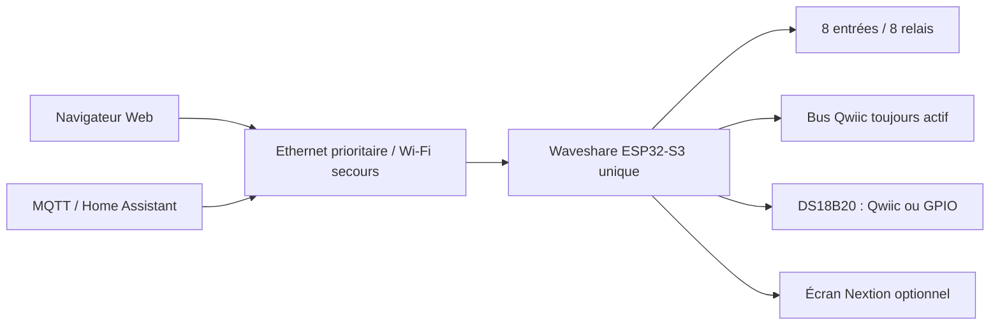

# Documentation Flow.io Waveshare 3.1.2

## Architecture actuelle

La cible 3.1.2 utilise **un seul ESP32-S3**, celui de la carte Waveshare
ESP32-S3-ETH-8DI-8RO. Il exécute la logique piscine, les entrées et relais,
Ethernet, Wi-Fi, le Web, MQTT, Home Assistant, OTA, la RTC et l'interface HMI.

## Démarrage rapide

1. Câbler la carte hors tension selon le [schéma 3.1.2](integration/schema-raccordement-waveshare.md).
2. Compiler et téléverser l'environnement PlatformIO `Waveshare-ESP32-S3`.
3. Raccorder Ethernet ; le Wi-Fi reste disponible en secours.
4. Ouvrir l'interface Web locale.
5. Dans `Configuration > io > drivers > ds18b20`, choisir le raccordement des
   températures, enregistrer puis redémarrer.
6. Vérifier les températures avant d'activer le mode automatique.

## Choix des sondes de température

| Choix Web | Eau | Air | Qwiic pour les autres composants |
|---|---|---|---|
| Qwiic / DS2484 | bus 1-Wire DS2484, index 0 | bus 1-Wire DS2484, index 1 | Actif |
| GPIO direct | GPIO20 | GPIO19 | Actif |

Le mode Qwiic est la valeur par défaut et préserve les configurations 3.1.0 et
3.1.1. Le changement prend effet au redémarrage.

## Documents utiles

- [Notes de version 3.1.2](release-3.1.2.md)
- [Raccordement complet](integration/schema-raccordement-waveshare.md)
- [Mise en service et essais](integration/mise-en-service.md)
- [Durcissement MQTT](mqtt-hardening.md)
- [Signature OTA](ota-signing.md)
- [Référence IOModule](modules/IOModule.md)
- [Référence WifiModule](modules/WifiModule.md)
- [Validations restant à effectuer](../RESTANT_A_FAIRE.md)

## Anciennes architectures

Les pages relatives aux profils `FlowIO`, `Supervisor` et à leur protocole I²C
sont historiques. Elles ne doivent pas être utilisées pour câbler la Waveshare
3.1.2. La source de vérité du montage actuel est le schéma de raccordement
3.1.2 indiqué ci-dessus.
