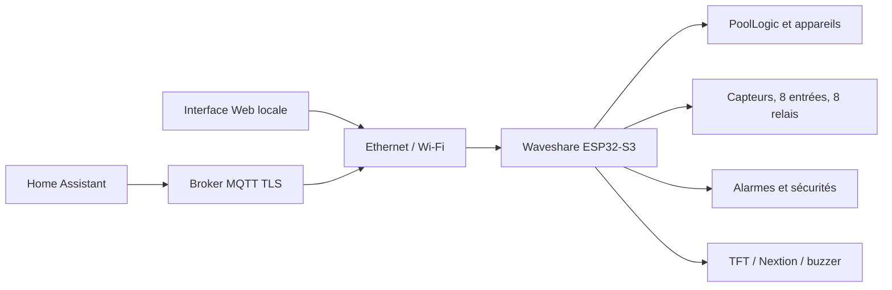

# Documentation Flow.io Waveshare 3.1.4

Cette documentation concerne la cible autonome
`Waveshare-ESP32-S3` : une seule carte Waveshare
ESP32-S3-ETH-8DI-8RO N16R8 exécute la logique piscine, les capteurs, les
relais, les sécurités, Ethernet, Wi-Fi, l’interface Web, MQTT, Home Assistant,
la RTC et les interfaces locales.

Le document d’entrée principal du projet est le [README général](../README.md).
Les travaux encore ouverts sont regroupés dans
[RESTANT_A_FAIRE.md](../RESTANT_A_FAIRE.md).

## Démarrage rapide

1. Couper les alimentations et réaliser le câblage selon le
   [schéma Waveshare](integration/schema-raccordement-waveshare.md).
2. Ouvrir le projet dans Visual Studio Code avec PlatformIO.
3. Sélectionner uniquement l’environnement `Waveshare-ESP32-S3`.
4. Compiler et téléverser le firmware.
5. Compiler et téléverser SPIFFS si la carte est vierge ou si l’interface Web a
   changé.
6. Ouvrir le moniteur série à 115200 bauds.
7. Suivre le [tutoriel de première connexion](integration/premiere-connexion.md)
   pour récupérer le mot de passe du point d'accès, créer l'administrateur et
   configurer le réseau.
8. Vérifier toutes les mesures et sorties avant d’activer un automatisme.

Le firmware et l’image SPIFFS doivent provenir de la même révision du projet.

## Architecture actuelle

Ethernet W5500 est prioritaire. Le Wi-Fi enregistré sert de secours et le
portail de configuration est lancé lorsqu’aucun réseau n’est disponible.
L’interface Web est servie en HTTP sur le réseau local et ne doit pas être
exposée directement à Internet.

## Installation et raccordement

- [Première connexion](integration/premiere-connexion.md) : point d'accès de
  secours, création de l'administrateur, Wi-Fi domestique et MQTT.
- [Mise en service](integration/mise-en-service.md) : flash, réseau, contrôles
  des entrées/sorties et activation progressive des automatismes.
- [Raccordement Waveshare](integration/schema-raccordement-waveshare.md) :
  alimentation, bus, capteurs, entrées, relais et broches réservées.
- [Schéma Fritzing](fritzing/README.md) : fichiers éditables du montage.
- [Plan de tests fonctionnels](integration/plan_tests_poollogic_pdm_io.csv).
- [Plan de tests séquentiels](integration/plan_tests_sequentiel_poollogic_pdm_io.csv).

Le câblage fonctionnel courant utilise notamment :

| Fonction | Raccordement |
|---|---|
| W5500 Ethernet | INT 12, MOSI 13, MISO 14, SCLK 15, CS 16, RESET 39 |
| Qwiic / I²C | SDA 42, SCL 41 |
| DS18B20 direct | eau GPIO20, air GPIO19 |
| Nextion UART2 | RX 44, TX 43 avec adaptation de niveaux |
| Buzzer | GPIO46 |
| Récupération physique | bouton BOOT, GPIO0 |

## Capteurs et entrées/sorties

- [IOModule](modules/IOModule.md) : acquisition, conversion, calibration,
  affectations et valeurs d’exécution.
- [Description du domaine piscine](integration/flowio-poollogic-business.md).
- [Adaptation du domaine](integration/adaptation-domaine.md).

Les sondes DS18B20 peuvent fonctionner :

- par le pont Qwiic DS2484 à l’adresse `0x18` ;
- directement sur GPIO20 pour l’eau et GPIO19 pour l’air.

Ce choix se trouve dans
`Configuration > io > drivers > ds18b20 > Raccordement des températures` et
prend effet après redémarrage. Le bus Qwiic reste actif pour les autres
composants dans les deux modes.

## Automatismes piscine

- [PoolLogicModule](modules/PoolLogicModule.md) : modes de fonctionnement,
  filtration, pH, désinfection, oxygène actif, électrolyse, robot, remplissage,
  chauffage assisté et surveillance de pression.
- [PoolDeviceModule](modules/PoolDeviceModule.md) : appareils, dépendances,
  interlocks, temps de marche et volumes injectés.
- [AlarmModule](modules/AlarmModule.md) : conditions, acquittements, sévérités et
  publications.
- [TimeModule](modules/TimeModule.md) : RTC, synchronisation et planification.

Les automatismes sont désactivés par défaut. La mise en service doit commencer
par les commandes manuelles, continuer en mode manuel sécurisé, puis activer les
fonctions automatiques une par une.

## Réseau, MQTT et Home Assistant

- [WifiModule](modules/WifiModule.md) : connexion station et données réseau.
- [MQTTModule](modules/MQTTModule.md) : connexion TLS, files de messages,
  producteurs et commandes.
- [Référence des topics MQTT](core/mqtt-topics.md).
- [HAModule](modules/HAModule.md) : génération de la découverte Home Assistant.
- [Tableau de bord Home Assistant](integration/home_assistant_dashboard_3_1_0.yaml).
- [Paquet Home Assistant](integration/home_assistant_package_3_1_0.yaml).

MQTT exige TLS ainsi qu’un utilisateur et un mot de passe. Le port par défaut
est `8883`. Les mesures, appareils, modes, consignes et alarmes sont exposés à
Home Assistant par MQTT Discovery.

Les fichiers Home Assistant fournis sont des exemples à contrôler avant usage :
leurs noms ne garantissent pas qu’ils couvrent toutes les entités générées par
le firmware actuel.

## Interface utilisateur et affichages

- [Interface Web modulaire](core/webinterface-assets-modular.md).
- [Exposition des valeurs d’exécution](core/runtime-ui-exposure.md).
- [HMIModule](modules/HMIModule.md) : écran Nextion et interactions locales.
- [Protocole Nextion](integration/nextion-esp-protocol.md).
- [SupervisorHMIModule](modules/SupervisorHMIModule.md) : référence du profil
  d’affichage distinct, hors cible Waveshare autonome courante.

L’interface Web complète est stockée dans SPIFFS. Une page de récupération
minimale reste disponible depuis le firmware lorsque SPIFFS est absent ou
endommagé.

## Sécurité et mises à jour

- [Durcissement de sécurité](security-hardening.md).
- [Signature des mises à jour OTA](ota-signing.md).

Les protections présentes comprennent l’authentification Web Digest, la
validation CSRF, la limitation des échecs d’authentification, MQTT TLS et la
vérification ECDSA P-256 des firmwares OTA. Aucun administrateur par défaut
n’existe : la création ou le remplacement du compte nécessite une pression de
cinq secondes sur BOOT et ouvre une fenêtre de récupération de cinq minutes.
Le point d’accès de secours utilise un secret aléatoire propre à la carte,
visible uniquement sur le moniteur série USB. Les API n’exposent pas les mots de
passe Wi-Fi ou MQTT enregistrés.

La clé publique OTA de production n’est pas incluse dans le dépôt. Secure Boot,
le chiffrement de la flash/NVS, l’anti-retour et la mise à jour signée de SPIFFS
restent à finaliser avant une série de production.

## Architecture logicielle

- [Structure générale du programme](program_structure.md).
- [Profils, cartes, domaines et application](core/profiles-board-domain-app.md).
- [Architecture du cœur](core/architecture.md).
- [Services entre modules](core/services.md).
- [Modèle données et événements](core/data-event-model.md).
- [Règles de qualité des modules](core/module-quality-gates.md).
- [Empreinte mémoire](core/memory-footprint-flowio.md).

Le profil Waveshare active les modules de journalisation, configuration,
données, commandes, alarmes, Ethernet, Wi-Fi, portail, Web, mise à jour, temps,
MQTT, Home Assistant, E/S, logique piscine, appareils, HMI, TFT et surveillance
système.

## Autres profils présents dans le dépôt

Les environnements `FlowIO`, `Supervisor`, `FlowConnectDisplay`, `Micronova` et
les variantes Wokwi utilisent une partie du même socle logiciel. Ils ne font pas
partie du périmètre de validation de la cible autonome Waveshare 3.1.4.

Les documents suivants concernent ces architectures distinctes :

- [Protocole Flow/Supervisor I²C](core/flow-supervisor-i2c-protocol.md) ;
- [Affichage distant](remote-display-udp.md) ;
- [Firmware Micronova](micronova-firmware.md).

Ils ne doivent pas être utilisés pour déduire le câblage ou la procédure de
flash de la Waveshare autonome.

## État de la documentation

Le [README général](../README.md) et le présent sommaire décrivent l’état actuel
du projet. Plusieurs fichiers secondaires, schémas ou exemples portent encore
un ancien numéro dans leur nom. Leur contenu doit être vérifié contre le code et
le raccordement courant avant usage. Leur mise à niveau est recensée dans
[RESTANT_A_FAIRE.md](../RESTANT_A_FAIRE.md).
