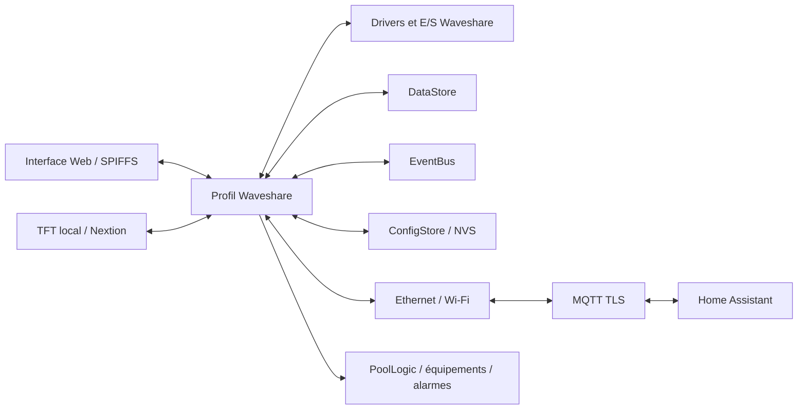

# Architecture du firmware Waveshare

Cette page décrit le seul profil firmware compilé sur la branche :
`Waveshare-ESP32-S3`. Les profils FlowIO, Supervisor, Flow Connect Display et
Micronova décrits dans d’anciens documents ne font pas partie de cette cible.

## Assemblage de l’application

`src/main.cpp` délègue le démarrage à `App::Bootstrap`. Celui-ci résout le
profil Waveshare, construit le contexte matériel et domaine, puis appelle le
bootstrap du profil. Le profil crée et enregistre ses modules dans
`ModuleManager`.

Les instances et leur ordre d’enregistrement sont définis dans :

- `src/Profiles/Waveshare/WaveshareProfile.h` ;
- `src/Profiles/Waveshare/WaveshareModuleInstances.cpp` ;
- `src/Profiles/Waveshare/WaveshareBootstrap.cpp` ;
- `src/Profiles/Waveshare/WaveshareIoAssembly.cpp` ;
- `src/Board/WaveshareBoard.h`.

Les modules réseau, configuration, stockage runtime, E/S, alarmes, historique,
HMI, logique piscine et équipements communiquent via les services, le
`DataStore` et l’`EventBus`. MQTT et Home Assistant sont activés selon la
configuration enregistrée.

## Cycle des modules

`ModuleManager` initialise les modules, charge la configuration persistante,
appelle les hooks de configuration puis démarre les modules selon leurs
dépendances et délais. Les modules peuvent fournir des tâches FreeRTOS ; les
boucles non bloquantes restent pilotées par le cycle principal ou par leurs
tâches dédiées.

Les dépendances entre modules sont déclarées et résolues par le gestionnaire.
Les services exposent des contrats étroits via `ServiceRegistry` plutôt que de
faire dépendre chaque module des classes concrètes des autres.

## Configuration et données d’exécution

- `ConfigStore` charge et persiste les réglages dans la NVS ;
- `DataStore` contient les mesures et états en cours ;
- `EventBus` signale les changements aux modules abonnés ;
- les producteurs enregistrés de `MQTTModule` publient les données autorisées
  vers le broker et Home Assistant.

Les identifiants de configuration et de données sont des contrats persistants.
Les anciens identifiants réservés ne doivent pas être renumérotés lors d’un
nettoyage de code.

## Tests

La CI compile uniquement `Waveshare-ESP32-S3`. L’environnement séparé
`platformio.native.ini` compile quelques tests unitaires host ; il ne constitue
pas un deuxième profil firmware.
