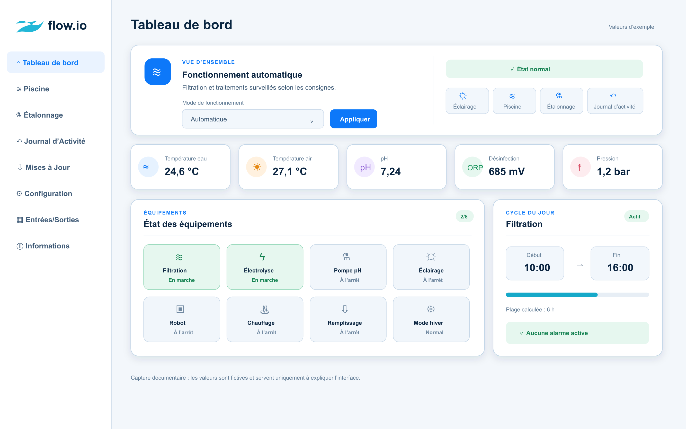
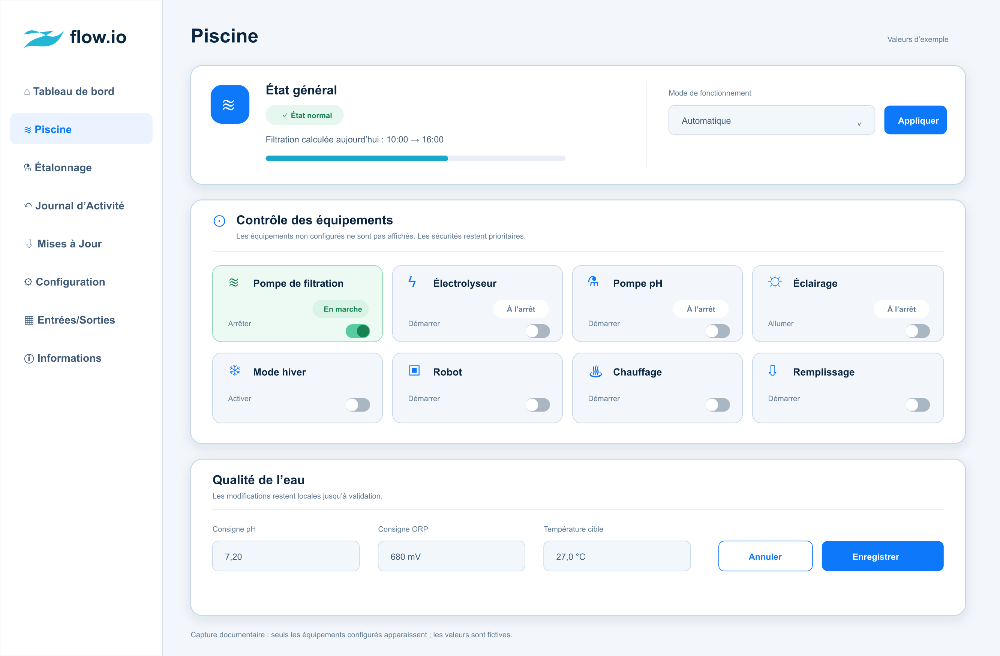
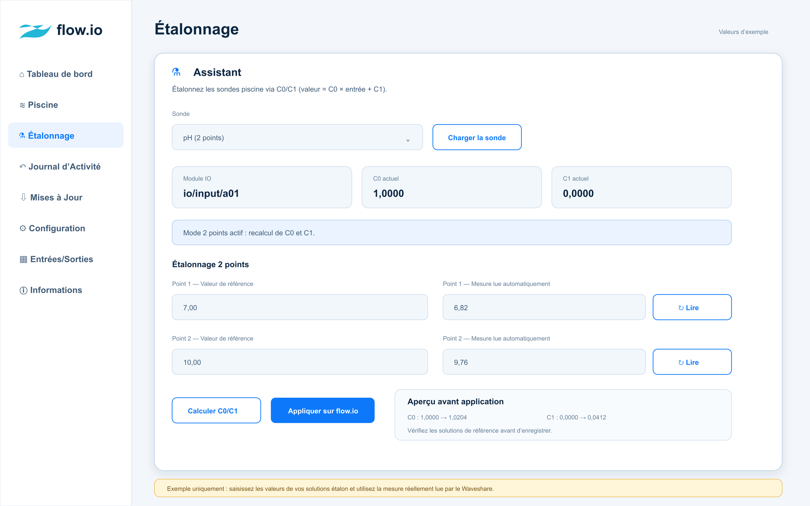

# Interface Web de la version 3.1.5

Cette page présente les principales vues opérationnelles de l’interface Web
Waveshare. Les valeurs visibles dans les captures sont fictives : elles servent
uniquement à expliquer l’organisation de l’interface et ne correspondent à
aucune installation réelle.

## Tableau de bord

Le tableau de bord rassemble l’état général, le changement du mode de
fonctionnement, les mesures principales, l’état des équipements, le cycle de
filtration et les alarmes actives.

Le menu `Mode de fonctionnement` permet de passer au mode souhaité sans ouvrir
la page Piscine. Le bouton `Appliquer` confirme le changement.

## Piscine

La page Piscine réunit l’état général, le mode de fonctionnement, les commandes
directes des équipements configurés et les consignes de qualité de l’eau. Un
équipement absent de la configuration n’est pas affiché.

Les changements de consigne restent locaux tant que le bouton `Enregistrer`
n’a pas été utilisé. `Annuler` rétablit les valeurs actuellement enregistrées.
Les sécurités matérielles restent prioritaires sur les commandes directes.

## Étalonnage

L’assistant d’étalonnage permet de sélectionner une sonde, de lire sa mesure et
de calculer les coefficients `C0` et `C1` à partir d’un ou de deux points de
référence.

Après la lecture des points, `Calculer C0/C1` affiche un aperçu des nouveaux
coefficients. Ils ne sont transmis au Flow.io qu’après confirmation avec
`Appliquer sur flow.io`.

## Confidentialité des captures

Les illustrations ont été reconstituées à partir de l’interface versionnée.
Elles ne contiennent ni adresse IP réelle, ni SSID, ni mot de passe, ni
identifiant MQTT.
