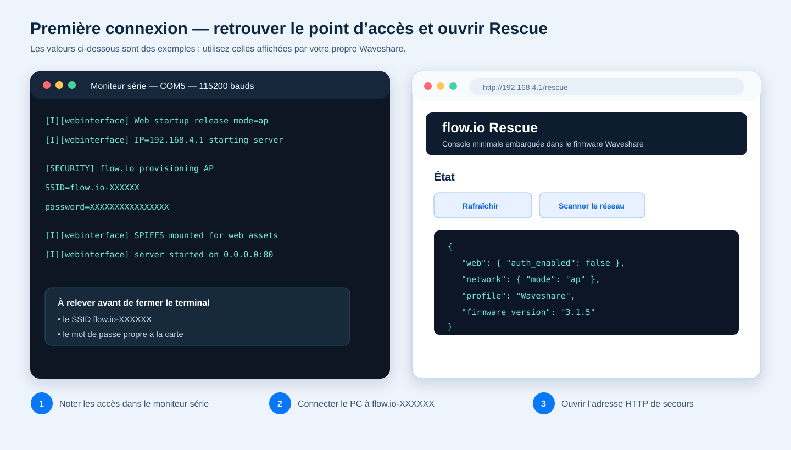
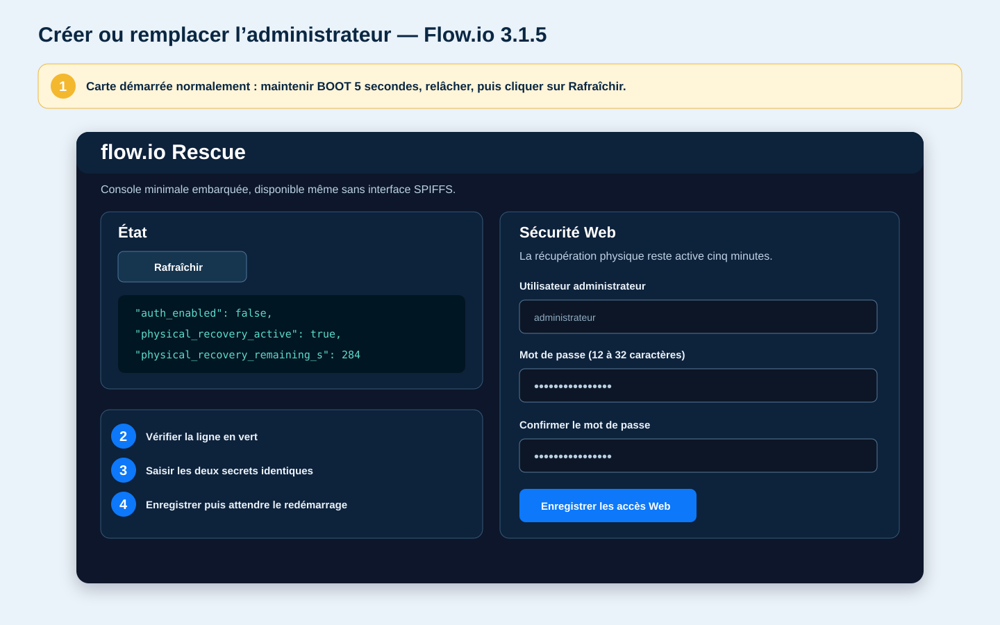
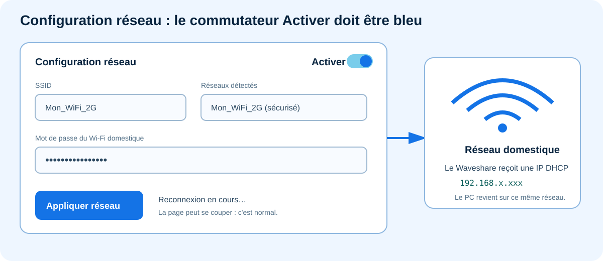

# Première connexion à Flow.io Waveshare 3.1.4

Cette procédure décrit la première mise en service après un effacement complet
ou sur une carte neuve. Elle permet de créer l'administrateur Web, de raccorder
le Waveshare au réseau local puis de configurer MQTT.

Laisser les équipements de puissance désactivés pendant toute cette première
configuration.

## 1. Préparer la carte

1. **Installer les deux images.** Flasher le firmware puis SPIFFS depuis la
   même révision. Le firmware démarre la carte ; SPIFFS contient l'interface
   Web complète.
2. **Brancher l'USB.** Relier le Waveshare au PC avec un câble USB permettant
   les données, et pas seulement la charge.
3. **Ouvrir le moniteur série.** Sélectionner le port COM de la carte et régler
   la vitesse sur `115200` bauds. Les informations de démarrage vont y
   apparaître.
4. **Démarrer normalement.** Mettre la carte sous tension ou appuyer brièvement
   sur RESET, sans maintenir BOOT. BOOT ne sera utilisé qu'à l'étape 3.

Sans Ethernet opérationnel ni Wi-Fi déjà enregistré, le Waveshare crée un
point d'accès dont le nom ressemble à :

```text
flow.io-XXXXXX
```

Le suffixe dépend de la carte. Son mot de passe aléatoire de 16 caractères est
affiché uniquement sur le port série USB, sur une ligne de ce type :

```text
[SECURITY] flow.io provisioning AP SSID=flow.io-XXXXXX password=XXXXXXXXXXXXXXXX
```

Ce mot de passe est propre à la carte et conservé après redémarrage. S'il n'est
plus visible dans le terminal, laisser le moniteur ouvert et redémarrer la
carte pour faire réapparaître la ligne.



## 2. Ouvrir la page de secours

1. **Changer de réseau sur le PC.** Dans la liste Wi-Fi de Windows, choisir
   `flow.io-XXXXXX`, puis saisir le mot de passe affiché dans le moniteur série.
   Le PC doit ensuite recevoir une adresse du type `192.168.4.x`.
2. **Rester sur le réseau Flow.io.** Windows signale qu'il n'y a pas d'accès à
   Internet, ce qui est normal. S'il revient automatiquement au Wi-Fi habituel,
   désactiver temporairement la reconnexion automatique de ce dernier.
3. **Ouvrir la page de secours.** Saisir directement
   `http://192.168.4.1/rescue` dans la barre d'adresse du navigateur. La page
   intitulée **flow.io Rescue** doit apparaître.

Utiliser `http`, et non `https`. L'adresse `192.168.4.1` n'est accessible que
lorsque le PC est connecté au point d'accès du Waveshare.

À ce stade, l'état doit normalement indiquer :

```text
auth_enabled: false
physical_recovery_active: false
```

Ne pas essayer de se connecter à l'interface complète : aucun compte
administrateur n'existe encore.

## 3. Créer l'administrateur

1. **Autoriser la création du compte.** Pendant que le Waveshare fonctionne
   normalement, maintenir **BOOT pendant au moins 5 secondes**, puis le
   relâcher. Ne pas appuyer sur RESET : la pression longue prouve une présence
   physique auprès de la carte.
2. **Actualiser l'état.** Cliquer sur **Rafraîchir** dans la page de secours
   pour relire l'état de sécurité du firmware.
3. **Contrôler l'autorisation.** La ligne `physical_recovery_active` doit passer
   à `true`. Le formulaire est alors utilisable pendant cinq minutes.
4. **Choisir les identifiants.** Dans **Sécurité Web**, saisir un nom
   d'administrateur et un mot de passe de 12 à 32 caractères, puis retaper le
   même mot de passe dans la confirmation.
5. **Enregistrer.** Cliquer sur **Enregistrer les accès Web**. Le firmware
   sauvegarde le compte puis programme un redémarrage environ huit secondes
   plus tard.



Le point d'accès `flow.io-XXXXXX` peut rester visible après ce redémarrage :
c'est normal, car le Wi-Fi domestique n'est pas encore configuré.

## 4. Se connecter comme administrateur

1. **Reconnecter le PC.** Après le redémarrage, vérifier que Windows est encore
   connecté au point d'accès `flow.io-XXXXXX`. Sinon, le sélectionner de
   nouveau ; son mot de passe n'a pas changé.
2. **Ouvrir l'interface complète.** Saisir
   `http://192.168.4.1/webinterface` dans la barre d'adresse. Une fenêtre
   d'identification du navigateur doit maintenant apparaître.
3. **S'authentifier.** Saisir le nom d'administrateur et le mot de passe créés à
   l'étape précédente. L'interface complète doit s'ouvrir et l'en-tête doit
   indiquer **Administrateur connecté**.

Si les bons identifiants sont refusés après une première tentative incorrecte,
fermer complètement le navigateur ou utiliser une fenêtre de navigation
privée. Le navigateur peut conserver temporairement une ancienne
authentification.

Sur la page de secours, une réponse `Unauthorized` après la création du compte
confirme que la protection est active ; il faut alors ouvrir l'interface
complète et s'authentifier.

## 5. Connecter le Waveshare au Wi-Fi domestique

Dans **Configuration réseau** :

1. **Activer le client Wi-Fi.** Basculer impérativement le commutateur
   **Activer** en haut à droite. Un SSID rempli avec ce commutateur gris ne
   déclenche aucune connexion.
2. **Choisir le réseau.** Lancer le scan, sélectionner le SSID du réseau
   domestique, puis vérifier qu'il apparaît aussi dans le champ SSID.
3. **Saisir son mot de passe.** Utiliser le mot de passe du Wi-Fi domestique,
   et non celui du point d'accès `flow.io-XXXXXX`.
4. **Appliquer.** Cliquer sur **Appliquer réseau**. Le Waveshare enregistre les
   paramètres et tente immédiatement de rejoindre le réseau choisi.



Le message `Configuration réseau appliquée (reconnexion en cours)` apparaît.
La coupure de l'interface et la déconnexion du point d'accès sont alors
normales.

Reconnecter le PC au réseau domestique, puis retrouver le Waveshare par l'une
des méthodes suivantes :

- `http://flowio.local/webinterface` si mDNS fonctionne sur le PC ;
- l'adresse DHCP attribuée au Waveshare, visible dans le routeur ;
- l'adresse IP affichée dans le moniteur série.

Si `flowio.local` n'est pas résolu, utiliser directement l'adresse IP. Le réseau
Wi-Fi doit être en 2,4 GHz et un signal proche ou inférieur à `-80 dBm` peut
rendre la connexion instable.

## 6. Configurer MQTT

Dans `Configuration > mqtt`, renseigner :

- **Nom d'appareil MQTT** : nom lisible dans Home Assistant ;
- **Topic de base** : par exemple `flowio` ;
- **MQTT activé** : activé ;
- **Broker MQTT** : nom DNS ou adresse IP, sans `http://`, `https://` ni
  `mqtts://` ;
- **Port MQTT** : `8883` pour MQTT TLS ;
- **Utilisateur MQTT** et **Mot de passe MQTT** : compte dédié à l'appareil ;
- **ID device MQTT topic** : laisser vide pour utiliser l'identifiant dérivé de
  la MAC, sauf besoin particulier.

Cliquer ensuite sur **Appliquer localement**. Si la page avait été laissée
ouverte pendant la création de l'administrateur ou un redémarrage et affiche
`apply refusé`, effectuer un rechargement complet avec `Ctrl+F5`, se
réauthentifier, ressaisir le mot de passe MQTT puis appliquer à nouveau.

## 7. Contrôler la mise en service

Vérifier dans l'en-tête ou le tableau de bord :

- **Réseau : connecté** ;
- **Sécurité : administrateur connecté** ;
- une heure synchronisée après l'accès au réseau ;
- **MQTT : connecté** ;
- l'apparition de l'appareil et de ses entités dans Home Assistant Discovery.

Avant d'activer un automatisme, contrôler séparément les capteurs, les entrées,
les relais, les consignes et les sécurités selon la
[procédure complète de mise en service](mise-en-service.md).

## Dépannage rapide

| Symptôme | Action |
|---|---|
| `192.168.4.1` est inaccessible | Vérifier que le PC est connecté à `flow.io-XXXXXX` et possède une adresse `192.168.4.x`. |
| La fenêtre d'identification apparaît avant la création du compte | L'annuler, revenir sur `/rescue`, maintenir BOOT cinq secondes et créer l'administrateur. |
| Le réseau Flow.io reste visible après la création du compte | C'est normal tant que le Wi-Fi domestique n'a pas été activé et appliqué. |
| Le Wi-Fi domestique ne se connecte pas | Vérifier le commutateur **Activer**, le mot de passe, la bande 2,4 GHz et la puissance du signal. |
| `flowio.local` ne fonctionne pas | Utiliser l'adresse IP DHCP du Waveshare. |
| Le navigateur signale une connexion non sécurisée | L'interface locale utilise HTTP. Ne jamais l'exposer directement à Internet. |
| MQTT ne se connecte pas | Vérifier le broker sans préfixe d'URL, le port `8883`, les identifiants, le certificat TLS et les journaux MQTT. |
