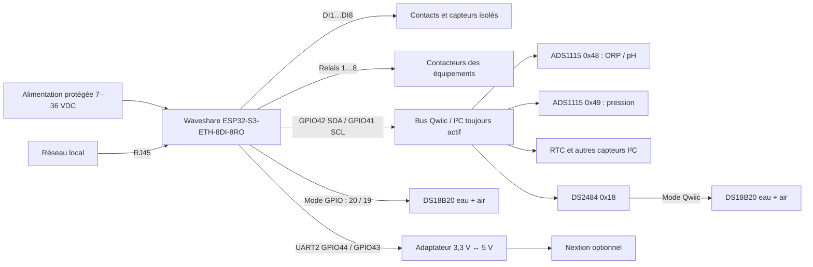

# Raccordement Flow.io Waveshare 3.1.2

Ce document décrit le profil autonome `Waveshare-ESP32-S3`. Une seule carte
ESP32-S3 est nécessaire.

> **Sécurité** — Couper toutes les alimentations avant intervention. Les relais
> doivent piloter des contacteurs correctement protégés. Ne jamais appliquer la
> tension secteur ni 24 V sur une broche GPIO 3,3 V. Faire valider le coffret
> final par un électricien qualifié.

## Vue d'ensemble

## Sondes DS18B20 sélectionnables

Le choix se trouve dans l'interface Web sous
`Configuration > io > drivers > ds18b20 > Raccordement des températures`.
Enregistrer puis redémarrer la carte.

### Mode Qwiic / DS2484 — défaut

| Signal | Raccordement |
|---|---|
| SDA | GPIO42 / Qwiic SDA |
| SCL | GPIO41 / Qwiic SCL |
| Pont 1-Wire | DS2484, adresse 0x18 |
| Sonde eau | bus 1-Wire commun, première ROM mémorisée |
| Sonde air | bus 1-Wire commun, seconde ROM mémorisée |

### Mode GPIO direct

| Sonde | DATA | Alimentation | Résistance nécessaire |
|---|---:|---|---|
| Eau | GPIO20 | 3,3 V + GND | 4,7 kΩ entre DATA et 3,3 V |
| Air | GPIO19 | 3,3 V + GND | 4,7 kΩ entre DATA et 3,3 V |

Utiliser une résistance par ligne et éviter le mode parasite à deux fils. Les
GPIO19/20 sont réservés aux températures lorsque ce mode est choisi.

Le mode GPIO ne désactive pas Qwiic : la RTC, les ADS1115 et les autres
capteurs I²C continuent d'utiliser GPIO42/GPIO41.

## Bus Qwiic / I²C

| Composant | Adresse prévue | Fonction |
|---|---:|---|
| DS2484 | 0x18 | Températures, seulement en mode Qwiic |
| ADS1115 interne | 0x48 | ORP et pH |
| ADS1115 externe | 0x49 | Pression / réserve analogique |
| INA226 | 0x40 par défaut | Mesures électriques optionnelles |
| SHT40 | 0x44 par défaut | Température/humidité optionnelles |
| BMP280 | 0x76 par défaut | Température/pression optionnelles |
| BME680 | 0x77 par défaut | Capteur environnemental optionnel |

Vérifier qu'aucune adresse optionnelle n'entre en conflit avec le matériel
réellement installé.

## Entrées numériques

| Entrée | GPIO interne | Fonction par défaut |
|---|---:|---|
| DI1 / i00 | GPIO4 | Niveau réservoir pH |
| DI2 / i01 | GPIO5 | Niveau désinfectant |
| DI3 / i02 | GPIO6 | Niveau piscine |
| DI4 / i03 | GPIO7 | Compteur d'eau, impulsions |
| DI5 / i04 | GPIO8 | Libre / retour contacteur |
| DI6 / i05 | GPIO9 | Libre / retour contacteur |
| DI7 / i06 | GPIO10 | Libre |
| DI8 / i07 | GPIO11 | Libre |

Utiliser les borniers d'entrées isolées de la carte conformément à la notice
Waveshare, pas les GPIO bruts pour des signaux industriels.

## Sorties relais

| Relais | Fonction par défaut |
|---|---|
| Relais 1 / EXIO1 | Pompe de filtration |
| Relais 2 / EXIO2 | Pompe pH |
| Relais 3 / EXIO3 | Pompe chlore/désinfectant |
| Relais 4 / EXIO4 | Robot |
| Relais 5 / EXIO5 | Remplissage |
| Relais 6 / EXIO6 | Électrolyseur |
| Relais 7 / EXIO7 | Éclairage |
| Relais 8 / EXIO8 | Chauffage |

Employer les contacts secs COM/NO pour une commande normalement arrêtée. Un
relais de carte commande la bobine d'un contacteur ; il ne doit pas alimenter
directement une pompe de puissance.

## Réseau, écran et broches réservées

| Fonction | Broches |
|---|---|
| W5500 Ethernet | INT 12, MOSI 13, MISO 14, SCLK 15, CS 16, RESET 39 |
| Qwiic / I²C | SDA 42, SCL 41 |
| Nextion UART2 | RX 44, TX 43 |
| Buzzer actif | GPIO46 |
| DS18B20 directs | eau 20, air 19 |
| Bouton BOOT / récupération | GPIO0 |

Le Nextion utilise une alimentation 5 V adaptée et une masse commune. Ajouter
un convertisseur de niveaux bidirectionnel compatible UART entre les niveaux
5 V de l'écran et 3,3 V de l'ESP32-S3.

## Contrôles avant mise sous tension

1. Contrôler les polarités et la continuité hors tension.
2. Vérifier qu'aucune tension supérieure à 3,3 V n'arrive sur les GPIO.
3. Vérifier les résistances 4,7 kΩ en mode DS18B20 GPIO.
4. Mettre sous tension sans activer le mode automatique.
5. Contrôler les températures et toutes les entrées dans l'interface Web.
6. Tester chaque relais séparément avant de raccorder les équipements.
