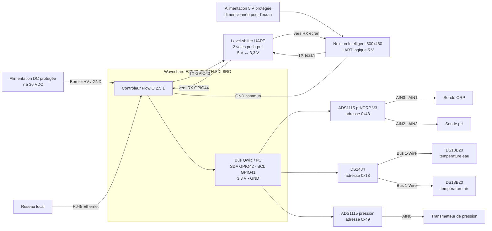
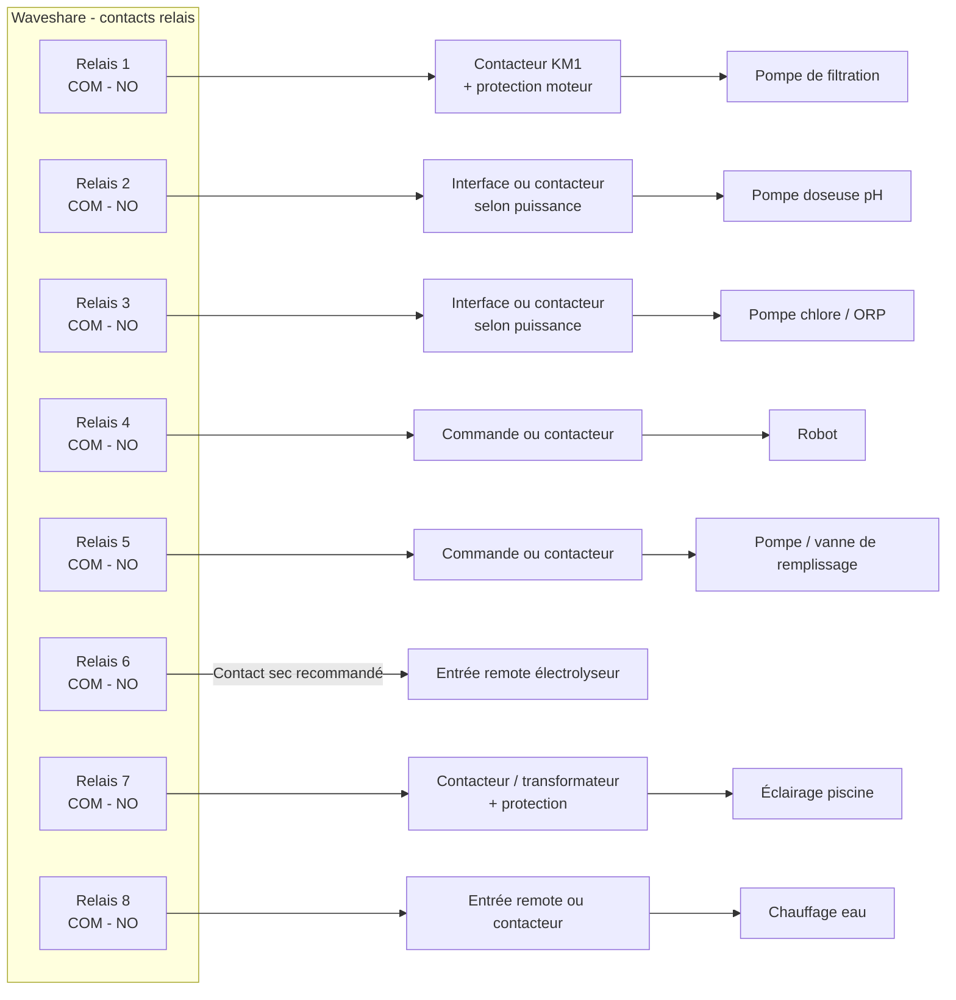
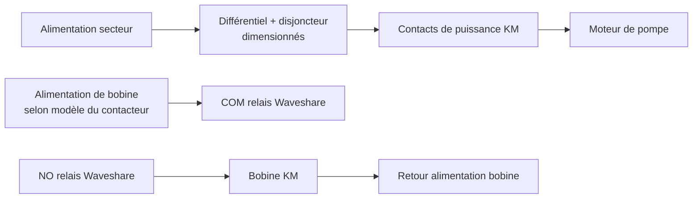

# Schéma de raccordement Waveshare Qwiic 2.5.1

Ce document décrit le raccordement fonctionnel correspondant au profil
`Waveshare-ESP32-S3` du firmware 2.5.1. Il ne remplace pas le schéma unifilaire
du coffret, le dimensionnement des protections, ni la validation par un
électricien qualifié.

> [!WARNING]
> Ne pas relier GPIO21 à la masse avec le firmware 3.1.0 : cette broche pilote
> désormais le rétroéclairage TFT. L’ancien cavalier de récupération 2.5.1
> n’est pas compatible avec le matériel actuel.

Une version éditable avec Fritzing est disponible dans
[`fritzing/FlowIO-Waveshare-Qwiic-2.3.0.fzz`](fritzing/FlowIO-Waveshare-Qwiic-2.3.0.fzz).

## 1. Contrôleur, alimentation et capteurs Qwiic

Le bus Qwiic doit présenter exactement les trois adresses attendues :
`0x18`, `0x48` et `0x49`. Les sondes DS18B20 eau et air partagent le bus
1-Wire du DS2484 et sont différenciées par leur ROM ID.

Le Nextion utilise l'UART2 à 115200 bauds dans le profil Waveshare :
`RX = GPIO44` et `TX = GPIO43`. Les signaux sont croisés (`TX` de l'écran vers
`RX` de la Waveshare et inversement). Un convertisseur de niveaux deux voies
compatible UART push-pull doit être intercalé entre les niveaux logiques 5 V
du Nextion et 3,3 V de l'ESP32-S3. Alimenter l'écran en 5 V avec une source
protégée et dimensionnée pour son modèle exact, avec une masse commune. Ne pas
alimenter l'écran depuis la sortie 3,3 V du bus Qwiic.

## 2. Entrées digitales

Les entrées `i00` à `i07` correspondent aux huit entrées digitales isolées de
la Waveshare. Pour les retours de contacteurs, raccorder le contact auxiliaire
à une interface optocouplée adaptée au bornier utilisé. Ne jamais appliquer
24 V directement à l'en-tête GPIO 3,3 V.

| Entrée FlowIO | Entrée Waveshare | GPIO interne | Fonction par défaut |
|---|---:|---:|---|
| `i00` | DI1 | `GPIO4` | Niveau piscine |
| `i01` | DI2 | `GPIO5` | Niveau réservoir pH |
| `i02` | DI3 | `GPIO6` | Niveau réservoir chlore |
| `i03` | DI4 | `GPIO7` | Compteur d'eau, entrée impulsionnelle |
| `i04` | DI5 | `GPIO8` | Retour auxiliaire du contacteur de filtration |
| `i05` | DI6 | `GPIO9` | Retour auxiliaire de l'électrolyseur |
| `i06` | DI7 | `GPIO10` | Réserve |
| `i07` | DI8 | `GPIO11` | Réserve |

Les retours `i04` et `i05` sont configurés actifs bas avec pull-up interne par
défaut. La surveillance reste désactivée jusqu'à sa validation dans la
configuration.

## 3. Sorties relais et équipements

Pour une commande normalement arrêtée, utiliser les bornes `COM` et `NO` du
relais concerné. La borne `NC` n'est pas représentée.

### Principe de puissance pour une pompe

Le relais Waveshare commande la bobine du contacteur ; il ne doit pas être
utilisé comme protection moteur. Prévoir une protection contre les arcs sur
les charges inductives (réseau RC ou varistance selon la tension et le
contacteur).

## 4. Points à confirmer avant câblage

- tension DC retenue pour le contrôleur et calibre de sa protection ;
- tension des bobines de contacteurs ;
- puissance et courant de démarrage de chaque pompe ;
- type électrique exact des capteurs de niveau et du compteur d'eau ;
- tension et plage de sortie du transmetteur de pression ;
- type d'entrée remote de l'électrolyseur et du chauffage ;
- section des conducteurs, mise à la terre et protections du coffret.

## 5. Sécurité

La partie secteur doit être câblée hors tension par une personne qualifiée.
Séparer physiquement TBTS/SELV, signaux analogiques et puissance. Chaque départ
doit recevoir les protections adaptées à sa charge. Les relais de la carte sont
donnés par Waveshare pour un maximum de 10 A à 250 VAC ou 10 A à 30 VDC, mais
le courant de démarrage des moteurs impose généralement l'emploi de
contacteurs correctement dimensionnés.

## Références

- `README.md`, sections « Bus Qwiic Waveshare », « Entrées de surveillance des
  contacteurs » et « Sorties par défaut » ;
- `src/Profiles/FlowIOS3/FlowIOS3IoLayout.h` ;
- documentation constructeur :
  <https://www.waveshare.com/wiki/ESP32-S3-ETH-8DI-8RO>.
