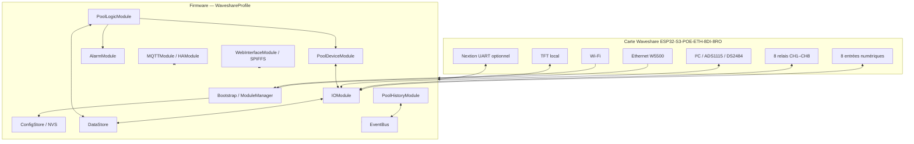

# Structure du programme Waveshare

Cette carte décrit les composants réellement utilisés par le profil
`Waveshare-ESP32-S3`. Les profils matériels historiques ne sont pas des cibles
de compilation de cette branche.

## Source de vérité du profil

- Environnement PlatformIO : `[env:Waveshare-ESP32-S3]` dans
  `platformio.ini`.
- Point d’entrée : `src/main.cpp` puis `src/App/Bootstrap.cpp`.
- Profil : `src/Profiles/Waveshare/`.
- Broches et capacités : `src/Board/WaveshareBoard.h`.
- Assemblage des entrées/sorties :
  `src/Profiles/Waveshare/WaveshareIoAssembly.cpp`.
- Ressources Web servies depuis SPIFFS : `data/webinterface/`.

L’ordre de démarrage et les dépendances effectives sont dans
`WaveshareBootstrap.cpp`. La présence d’un fichier sous `src/Modules/` ne
signifie pas à elle seule qu’un module est enregistré : vérifier cet assemblage
avant de le déclarer actif ou de le supprimer.
